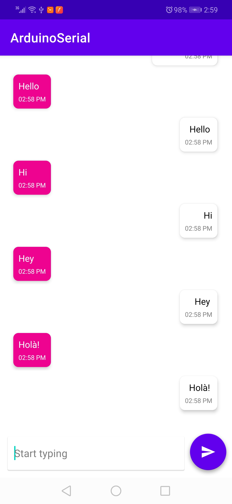

# MORF: Messaging Over RF
The goal behind this project is to build a chat application that doesn't use the traditional communication channels integrated into the mobile device and rather use an external radio module and bypass the mobile network interfaces.

This android application communicates with an RF module through an OTG cable that is connected to a UART-To-USB converter

## TODOs ✅

- [ ] Show notification on message reception
- [ ] Disable UI when serial connection is not open
- [x] Buy or find a second OTG cable
- [ ] Test app on 2 phones with RF modules
- [x] Change app/project/repo name
- [ ] Add transport protocol layer on top of RF for message acknowledgment
- [ ] Add an application protocol layer on top of the transport to define the packet format(metadata, data...)
- [ ] Add symmetric encryption to secure communication
- [ ] Replace it with asymmetric encryption
- [ ] Add messages local storage
- [ ] Add user management

